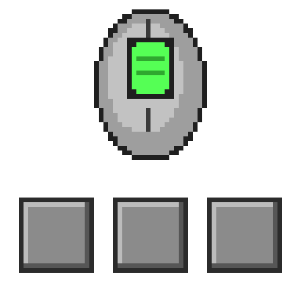

# Mouse Scroll Fix — Minecraft 1.20.1 / Forge 47.4.21



面向 Linux 玩家的 1.20.1 Forge 客户端 mod，做三件事：

1. **让 1.20.1 能在原生 Wayland 上跑起来。** 原版会因 GLFW 的 `0x1000C`
   （Wayland 不提供窗口位置、不支持设置窗口图标）直接崩溃或卡在弹窗。
2. **让鼠标指针跟随桌面配置的游标主题。** 原生 Wayland 下指针由 GLFW 决定，而 GLFW 只认
   `XCURSOR_THEME` 环境变量，桌面环境并不导出它，于是退化成一套通用箭头。
   **v1.4.0 起这一项默认关闭**（原因见第六节第 3 条），开关在「Mods 列表 → 本 mod → Config」。
3. **让滚轮「转一格 = 切一格」**，等同原版那个「离散鼠标滚动」选项，但默认开启、不用玩家记得去点。

第 3 条需要说明一下：原版选项之所以不够用，是因为它只对**事件的值**取符号，而 Linux 桌面上出问题
的是**事件的个数**——滚轮格数在游戏拿到之前就已经被桌面改掉了，详见第一节。Windows 与 macOS
没有这一层，所以前两条之外的部分在那边等于空转。

- 产物：`build/libs/mousescrollfix-1.4.0.jar`
- 纯客户端 mod，不影响联机（`clientSideOnly=true`）
- **只在干净环境（无其他 mod 的开发客户端）验证过，未在大型整合包里验证**，见第六节

---

## 一、问题到底是什么

不是 Minecraft 的 bug，也不是滚轮坏了，而是**桌面环境与游戏叠加**的结果。

KDE 允许给每个输入设备单独设置「滚动速度」，它按设备存在 `~/.config/kcminputrc` 里，长这样：

```ini
[Libinput][9390][5138][你的设备名]
ScrollFactor=1.5
```

（键名在「系统设置 → 鼠标与触摸板 → 滚动速度」。其它桌面也有类似机制，只是存法和生效范围不同；
GNOME 不提供这个倍率，所以本 mod 在 GNOME 上没有滚轮方面的作用。）

这个倍数的作用方式和一般人想的不一样。用 `/dev/uinput` 造一个虚拟鼠标、让 KWin 像处理真鼠标
一样处理它，再数游戏真正收到几个滚轮事件，可以得到下面两组结果。

### 游戏跑在 X11 / XWayland 时

| 设备倍数 | 转 12 格，游戏实际收到 | 每个事件的值 | 相邻事件的间隔 |
|---|---|---|---|
| 1.0（默认） | 12 个事件 | 全部 `+1.0` | 200 ms（＝转格节奏） |
| **1.5** | **18 个事件** | 全部 `+1.0` | 200 ms 与 **0.8 ms** 交替（每 2 格来一对） |
| 0.75 | **9 个事件** | 全部 `+1.0` | `200 200 400` 循环 |
| 0.1 | **1 个事件** | `+1.0` | —— |

关键点：**事件的值永远是 ±1.0，桌面改的是事件的「个数」。**

倍数 **> 1** 时，多出来的那个事件**紧跟在原事件后面 0.8 毫秒**。它不是「又转了一格」——
人不可能在 1 毫秒内转两格，真实的两格之间即使狠转也有好几毫秒——而是**同一格被复制了一份**。
v1.3.0 起 mod 会认出它：判定标准是「同一方向、间隔小于 2 毫秒」，于是 12 格就是 12 格。

倍数 **< 1**（0.75、0.1）时，事件是被**吞掉**的：转 4 格只有 3 个事件到达，第 4 格的信息在到达
游戏之前就没了。**这种没有任何办法还原**，mod 也一样（游戏内「离散鼠标滚动」开关、
`mouseWheelSensitivity` 滑块同样无济于事，因为事件本来就是 ±1）。

而原版 Minecraft 是「一个事件 = 切一格」，所以在修复之前：

- 倍数 1.5 → 每格切 1.5 格 → **有时连切两格，看起来像跳过物品**
- 倍数 0.75 → 每格切 0.75 格 → **滚一下不动、滚两下切一格、再滚跳过一格**
- 倍数 0.1 → 滚 10 格才切一格

### 游戏跑在原生 Wayland 时

| 设备倍数 | 转 12 格，游戏实际收到 | 每个事件的值 |
|---|---|---|
| 1.5 | **12 个事件（一格一个）** | **`+1.5`** |
| 0.1 / 2.0 等其它值 | 同样 12 个事件 | 等于该倍数 |

这时候倍数变成事件的**数值**，事件个数恢复成 1:1。
于是只要把数值归一化成 ±1，就是完美的「一格 = 一格」。

原生 Wayland 下 mod 做得最彻底：不管系统倍数是 0.1 还是 2.0，都是一格一步（这也是推荐的用法）。

---

## 二、怎么用

### 1. 把 jar 放进 `mods` 文件夹

只放这一个 jar。**先在一个没有其他 mod 的 1.20.1 Forge 实例里试**，确认没问题再放进整合包。

### 2. 让 Minecraft 用原生 Wayland（推荐）

MC 1.20.1 自己带的 GLFW（LWJGL 3.3.1 打包的那份）**即使编译进了 Wayland 后端，在 Wayland 会话里
也仍然选 X11**——它是 `XDG_SESSION_TYPE` 选择逻辑加入之前的 3.4 快照。发行版自带的 GLFW
（Arch 上是 3.5.1）会自动选 Wayland，把它换进来即可：

```bash
# 先找你系统上 GLFW 的实际路径
ldconfig -p | grep libglfw
# Arch:    /usr/lib/libglfw.so.3
# Debian/Ubuntu: /usr/lib/x86_64-linux-gnu/libglfw.so.3
```

然后给实例加一条 JVM 参数（值换成上面查到的路径）：

```
-Dorg.lwjgl.glfw.libname=/usr/lib/libglfw.so.3
```

加参数的位置各启动器不同，一般在「实例设置 → 高级设置 → JVM 参数」。
HMCL 的「使用系统 GLFW」开关**也能达到同样效果**，两者选一个即可，都写上也不冲突。

> **系统 GLFW 太老就没有这条路**：GLFW 3.3.x 根本没有 Wayland 后端，Ubuntu/Debian 这类
> 老 LTS 上要么自行编译一份 ≥ 3.4 的 GLFW，要么放弃原生 Wayland。要的不是「最新版」，
> 而是一份**在 Wayland 会话里会选 Wayland** 的 GLFW：版本 ≥ 3.4 且带上 `XDG_SESSION_TYPE`
> 判断逻辑（发行版自带的一般都满足）。

**不换也可以**：v1.3.0 起 X11 / XWayland 下 mod 会合并「被复制的同一个格」，倍数 > 1 的跳格
问题在那里同样能修好；但倍数 < 1（事件被吞掉）的仍然只能靠原生 Wayland 这条路解决。

### 3. 确认生效

启动游戏后看 `logs/latest.log`，应该出现：

```
[mousescrollfix] GLFW 3.5.1 Wayland X11 GLX Null EGL OSMesa monotonic shared | window backend: wayland (libX11 also present)
[mousescrollfix] desktop cursor theme 'breeze_cursors' from /home/<用户名>/.config/kdedefaults/kcminputrc: /usr/share/icons/breeze_cursors/cursors/default, 32px image, nominal size 24, hotspot 4,4
```

第一行是后端，写 `x11 / xwayland` 说明第 2 步的 JVM 参数没生效 —— 这时 mod 走 X11 的
「合并被复制的格」修复（只修「被调快」的一半，日志里会注明）。
第二行说明指针已换成桌面主题（主题名、来源文件、尺寸都会打出来；换了主题这里就跟着变，
`fix_cursor_theme = false` 时不会出现这一行）。

日志里还有一行 `[mousescrollfix] scroll fix in this session: ... | X11 detection: ...`，
它说明这次运行适用哪套修复、以及有没有从系统配置里读到滚轮倍率（在哪个文件读到的）。
**觉得「没效果」时先看这一行**：如果它写 `no KDE wheel ScrollFactor found in [...], nothing to merge`，
括号里就是它查过的文件，据此能判断是配置读取的问题还是系统本来就没给滚轮加倍率。

### 4. 想看到证据的话

改 `config/mousescrollfix-client.toml`：

```toml
debug_log = true          # 每个滚轮事件写进 logs/mousescrollfix-debug.log
self_test_on_join = true  # 进世界 4 秒后自动跑一次自检
```

或者进世界后输入 `/mousescrollfix test`。日志长这样（原生 Wayland，系统倍数 1.5）：

```
t=1790187718166 raw=+1.5000 norm=+1.0000 gapUs=-1     ctx=world  slotBefore=7
t=1790187718366 raw=+1.5000 norm=+1.0000 gapUs=199763 ctx=world  slotBefore=6
t=1790187718566 raw=+1.5000 norm=+1.0000 gapUs=199909 ctx=world  slotBefore=5
```

`raw` 是 GLFW 交出来的原值，`norm` 是修复后交给原版的值，`gapUs` 是距上一个事件多少微秒
（`t` 是毫秒时间戳）。上面这段就是「转 3 格 → 物品栏 7,6,5」，一格一格。

X11 / XWayland 下会多出 `DUPLICATE-DROPPED` 行和更小的 `gapUs`：

```
t=1790187718366 raw=+1.0000 norm=+0.0000 gapUs=193    ctx=world  slotBefore=6 DUPLICATE-DROPPED
t=1790187718566 raw=+1.0000 norm=+1.0000 gapUs=199909 ctx=world  slotBefore=6
```

第一行就是「同一格被复制出来的第二个事件」：它紧跟着前一个事件（193 微秒），被丢掉、不算一格；
第二行才是下一个真实格。

---

## 三、实测结果

测试环境：KDE Plasma 6 / Wayland / KWin 6，鼠标设备的 `ScrollFactor = 1.5`，
用 `/dev/uinput` 虚拟鼠标复现，所有数值均为实测。

| 环境 | 转 12 格，游戏收到几个滚轮事件 | 每个事件的值 | 结果 |
|---|---|---|---|
| 原版 + X11 | **18 个** | `+1.0` | 每格切 1.5 格，错乱 |
| 原版 + 原生 Wayland | 12 个 | `+1.5` | 每格还是切 1.5 格（原版把 1.5 当数量） |
| **本 mod + 原生 Wayland** | 12 个 | `+1.0`（mod 转换后） | **正好一格一格** |

### X11 / XWayland 下（v1.3.0 的合并修复）

同样是「转 12 格」（开发客户端跑在 XWayland，虚拟鼠标冒充 ScrollFactor 1.5 的设备）：

| 配置 | 收到事件 | 判为复制 | 物品栏实际切格 |
|---|---|---|---|
| `x11_fix = "off"`（对照组，等于没装这个修复） | 18 | 0 | **18** ← 跳格 |
| `x11_fix = "auto"`（默认，mod 自己读 kcminputrc 判定） | 18 | 6 | **12** ← 一格一格 |
| 默认设备（倍数 1.0，系统没给它加倍率） | 12 | 0 | 12（不受影响） |
| 倍数 1.5，每 20 ms 一格（50 格/秒，狠转的节奏） | 18 | 6 | **12**（快滚没被吃掉） |

物品栏路径（默认那行）：`8,7,6,5,4,3,2,1,0,8,7,6,5` —— 12 格正好 12 步，含 9 格回绕。
被合并的复制事件实测间隔 138–197 微秒，而判定窗口是 2 毫秒，差 10 倍以上。

**会不会把真实的快速滚动也当成复制吃掉？** 实测 200 格连续快滚（每 50 ms 一格）：
收到 300 个事件 = 200 × 1.5、100 对全部合上、最终正好 200 步 —— 一个都没漏，也没有多吃。
加上另外 42 对，共 142 个复制对全部正确合并。

进世界后自动自检的输出（`yOffset` 是「一格」被模拟成的原始值，格子里的数字是这一格
让物品栏走了几格）：

```
yOffset   notch1 notch2 notch3 notch4
+0.10         -1     -1     -1     -1
+0.75         -1     -1     -1     -1
+1.00         -1     -1     -1     -1
+1.50         -1     -1     -1     -1
+2.00         -1     -1     -1     -1
RESULT: PASS - every simulated notch moved exactly 1 slot
```

从 0.1 到 2.0 全部恰好一格 —— 也就是说，**换成别的鼠标、或者改桌面的滚动速度，mod 依然是对的**。

---

## 四、配置项

`config/mousescrollfix-client.toml`（首次启动自动生成）

| 项 | 默认 | 说明 |
|---|---|---|
| `enabled` | `true` | 总开关 |
| `affect_screens` | `true` | 背包/JEI/创造物品栏等 GUI 也一并处理；设 `false` 则只修快捷栏 |
| `x11_fix` | `"auto"` | X11 / XWayland 专用：是否合并「被复制的同一个格」。`auto` ＝只在 KDE 的 `kcminputrc` 里读到 **ScrollFactor > 1** 时才启用（这样的机器上才存在复制事件，mod 于是不会去动它帮不上的系统）；`on` ＝任何 X11 会话都合并；`off` ＝完全不合并（等同没装这个修复） |
| `x11_merge_ms` | `2` | 两个同方向事件间隔小于这个毫秒数就算同一格。实测复制事件相隔 0.15–0.95 ms、真实两格至少几毫秒，所以 2 很安全；实际效果是「每帧最多一格」。`0` 关闭 |
| `debug_log` | `false` | 把每个滚轮事件写进 `logs/mousescrollfix-debug.log` |
| `self_test_on_join` | `false` | 进世界后自动跑一次自检（含 X11 的合并自检） |
| `backend_hint` | `true` | 如果游戏没跑在原生 Wayland 下（X11 / XWayland），进主菜单时弹一条提示，说明那里「滚轮被调快的已修、被调慢的修不了」。只在**确实检测到** X11/XWayland 时才弹（Windows/macOS 检测不到后端，永远不弹） |
| `fix_cursor_theme` | `false` | 把鼠标指针换成桌面的游标主题（仅原生 Wayland 生效）。**v1.4.0 起默认关闭**，原因见第六节第 3 条。游戏内可在「Mods 列表 → 本 mod → Config」拨这个开关，改动即时生效并写回本文件；设回 `false` 恢复 GLFW 的默认箭头 |
| `cursor_theme` | 空 | 仅当 `fix_cursor_theme = true` 时有用。留空＝自动读桌面设置；只有当 mod 认不出你的桌面环境时，才需要手填主题名（`/usr/share/icons` 下的目录名） |
| `cursor_size` | `0` | 仅当 `fix_cursor_theme = true` 时有用。游标尺寸（逻辑像素），`0`＝用桌面配置的尺寸（读不到时 24） |

游戏内命令：`/mousescrollfix test`（跑自检）、`/mousescrollfix status`（看当前状态：后端、这里
适用哪套修复、X11 检测结果）、`/mousescrollfix cursor`（重新应用并打印指针用的是哪个主题、
哪个文件）、`/mousescrollfix hint`（手动弹一次那条环境提示，原生 Wayland 下想看效果时用）。

---

## 五、这个 mod 做了什么

| 类 | 作用 |
|---|---|
| `MouseHandlerMixin` | **核心**：把每个滚轮事件的 `yOffset` 交给 `ScrollNormalizer` 处理后再交给原版后续逻辑。一行原版代码都没改写，所以旁观者调速、创造模式飞行、`ForgeHooksClient.onMouseScroll`（其他 mod 的滚轮功能）全部照旧 |
| `ScrollNormalizer` | 两套修复都在这：原生 Wayland 下把数值归一到 ±1；X11/XWayland 下把「同一瞬间的第二个同向事件」判为复制并丢弃 |
| `X11Scaling` | 读 KDE 的 `kcminputrc`，看是否存在 `ScrollFactor > 1` 的设备 —— 有这个才说明系统真的在复制滚轮事件，`x11_fix = "auto"` 据此决定是否启用合并 |
| `GlxWaylandCompatMixin` | 让 MC 1.20.1 能在 Wayland 上启动：原版会把 GLFW 的 `0x1000C`（"Wayland 不提供窗口位置"）当成致命错误直接崩溃 |
| `WindowWaylandCompatMixin` | 同上，处理启动后的另一条：`0x1000C`（"Wayland 不支持设置窗口图标"）会让原版弹「请更新显卡驱动」对话框卡死。两个 Mixin 都只放过 `0x1000C` 这一个错误码并记日志，其他 GLFW 错误照常按原版处理 |
| `CursorThemeFix` | **v1.4.0 起默认关闭**：Wayland 下窗口上的指针由 GLFW 决定，而 GLFW 只认 `XCURSOR_THEME` 环境变量（桌面环境不导出它），于是显示通用箭头。这个类自己去读桌面配置（KDE `kcminputrc`／GTK `settings.ini`／环境变量），在开界面时把主题里的箭头交给 GLFW。GLFW 在抓取/释放鼠标时会忘记窗口游标，所以每 10 秒和每次开界面都会重新应用一次 |
| `ScrollFixConfigScreen` | Mods 列表里的设置界面（Forge 1.20.1 自己没有配置界面，不注册的话设置只存在于 toml 文件里）。目前只有一个指针开关，鼠标悬停时说明桌面主题光标的风险；拨动后立即改配置、存盘，并重建或释放游标，不用重启 |
| `XCursorFile` | 解析 Xcursor 文件格式（主题里 `.cursor`/`cursors/*` 的格式），挑出与请求尺寸最接近的那一档箭头，把预乘 ARGB 转成 GLFW 要的直通 RGBA |
| `EnvInfo` | 判断游戏实际用的是原生 Wayland 还是 X11/XWayland（读 `/proc/self/maps`，看进程里绑的是 `libwayland-client` 还是 `/libX11.so`），两种都没读到就返回"未知"、什么都不做 |
| `BackendHint` | 判定为 X11/XWayland 时，在主菜单弹一次提示（每次启动最多一次），说明那边「被调快的已修、被调慢的修不了」。Windows/macOS 上后端检测不到，按构造不会误报。文案走 lang 文件，`en_us` 与 `zh_cn` 各一份 |

---

## 六、已知限制与风险（请先看完再用）

1. **只在干净环境验证过。** 测试时用的开发客户端没有装其他 mod。切换图形后端可能和渲染类、
   截图类、输入类、录屏类 mod 冲突，**所以先在空实例里试，不要直接放进整合包**。
2. 换到原生 Wayland 会改变整个窗口/输入/缩放后端，副作用不止滚轮：
   - 窗口图标没设置（日志里会出现那条被忽略的警告）
   - Wayland 不提供窗口位置，游戏可能记不住窗口坐标
   - 分数缩放（如 1.25x）下的画面、光标行为可能和以前不同

3. **鼠标指针可以换成桌面主题 —— 但 v1.4.0 起默认关闭。**
   背景是这样：Wayland 下窗口上的箭头完全由 GLFW 给出（Minecraft 本体从不调用 `glfwSetCursor`，
   整个客户端里只有 `glfwSetCursorPos` 和几个回调），而 GLFW 的 Wayland 后端既没有
   compositor 侧的游标形状协议（在 `/usr/lib/libglfw.so.3` 里搜不到任何 `wp_cursor_shape`），
   主题名又**只认 `XCURSOR_THEME` / `XCURSOR_SIZE` 环境变量**——KDE 在 X11 侧把主题写进 X 资源库
   （`xrdb -query` 里能看到 `Xcursor.theme: breeze_cursors`），Wayland 侧却不导出这两个变量，
   于是 GLFW 退回名为 `default` 的主题，而 `/usr/share/icons/default/index.theme` 只有一行
   `Inherits=Adwaita` → 看到的是一套通用的 Adwaita 箭头。

   想靠环境变量修是**行不通的**：Forge 的早期启动窗口（`Loading ImmediateWindowProvider
   fmlearlywindow`）在 mod 加载之前就初始化了 GLFW，而 GLFW 的游标主题只在那一刻读一次环境变量。
   所以 mod 的做法是自己读桌面配置（KDE 的 `kcminputrc` / `kcminputrc` 的 `kdedefaults` 默认文件 /
   GTK 的 `settings.ini`，都没有才看环境变量），把主题里的箭头图像解析出来直接交给 GLFW。
   换主题它就跟着换；X11 下这个功能自动跳过（那边本来就正常）。

   实测（1.25x 分数缩放）：把它和两套主题的原始箭头做逐像素模板匹配，
   Breeze 平均色差 33.6、Adwaita 130.2（主菜单）；进世界后按 ESC（鼠标抓取→释放的完整周期）
   复测 38.4 / 142.4；把功能关掉则反过来变成 Adwaita 45.2 / Breeze 113.9 —— 即修复前看到的就是 Adwaita。
   `/mousescrollfix cursor` 可以随时查看它当前用的是哪个主题、哪个文件。

   **为什么默认关闭**：这一项是 mod 里唯一会调用 `glfwSetCursor` 的地方，而 2026-09-27 在一次
   大型整合包实测中遇到一次崩溃 —— 崩溃点在 GLFW 清理「鼠标锁定」对象时撞上一个已经释放的
   Wayland 对象指针（野指针）。那是 Ixeris（把 GLFW 事件轮询搬到另一个线程）和系统 GLFW 3.5.1
   的 Wayland 后端之间的线程竞态，根因不在本 mod；但本 mod 的调用会去碰这份状态，所以选择默认不动它。
   完整证据链见 `FINDINGS.md` 第 9 节。要桌面主题光标，就在设置界面里打开，风险自担。

4. **X11 / XWayland 下只能修一半**：倍数 > 1（事件被复制）的那半 v1.3.0 起能修好，
   倍数 < 1（事件被吞掉）的那半修不了 —— 那些格在到达游戏之前就没了，任何客户端 mod 都救不回。
   这种情况会在主菜单弹一条提示说明（`backend_hint = false` 可关掉）。
   另外两处已知边界：**自由滚轮**（没有段落感、能一直转的飞轮）和**触控板**在 X11 下能报出
   每秒上百次点击，同一帧里的连续两次会被当成复制合掉；有段落感的鼠标物理上做不到
   （要 ≥ 125 格/秒），所以正常滚轮不受影响。
5. **GNOME 上滚轮部分无效**：GNOME 不提供每设备滚动倍率（没有 `kcminputrc` 那套机制），
   事件本来就是 ±1，没有东西可修。原生 Wayland 与指针主题两项仍可正常工作。
6. 如果原生 Wayland 在整合包里问题太多，**最省事的替代方案**是把该设备的 KDE 滚动速度改回默认
   （1.0）—— 实测那样 X11 下就是 12 格 = 12 事件 = 12 格，和 Windows 完全一致，不需要任何 mod。
   代价是这个设备在桌面所有程序里都会滚得快一些。
7. 自检是直接调用原版的 `MouseHandler.onScroll`（绕过物理滚轮），
   走的是**完全相同**的代码路径，只是不需要真的去转鼠标。

## 七、Wayland 下窗口比屏幕还大（与本 mod 无关，但顺手说明）

启动器把窗口尺寸当参数传给游戏。如果启动器里存的是**物理分辨率**，而 Wayland 下窗口尺寸按
**逻辑像素**算，这个窗口就会变成「物理分辨率 × 缩放倍数」，比屏幕本身还大，怎么摆都装不下。
例如存 2560×1440、缩放 1.25 → 实际开出 3200×1800 物理像素的窗口，而屏幕只有 2560×1440。

逻辑尺寸 = 物理分辨率 ÷ 缩放：

| 屏幕 | 物理 | 缩放 | 逻辑（能用的最大窗口） |
|---|---|---|---|
| 2560×1440 | 2560×1440 | 1.25 | **2048×1152** |
| 2560×1600 | 2560×1600 | 1.4 | **1829×1143** |

改法：启动器 → 实例设置/全局游戏设置 → 把「窗口宽度/高度」改成不超过上表逻辑尺寸的值。
推荐 `1920×1080`（物理 2400×1350，留出边距）或 `1600×900` 更小巧。改完重启游戏生效。
想铺满屏幕就在游戏里按 F11 用全屏，全屏不受这个问题影响。

## 八、卸载

删掉 `mods/mousescrollfix-1.4.0.jar`，并去掉那条 `-Dorg.lwjgl.glfw.libname`
JVM 参数（去掉后就回到 X11，一切恢复原样，系统设置从未被修改过）。

## 九、给开发者

```bash
# 编译（需要 JDK 17；Gradle 用工程自带的 wrapper，固定 8.8）
JAVA_HOME=/usr/lib/jvm/java-17-openjdk ./gradlew build

# 普通开发客户端（X11）
JAVA_HOME=/usr/lib/jvm/java-17-openjdk ./gradlew runClient

# 原生 Wayland 开发客户端（等价于上面第 2 步的 JVM 参数）
JAVA_HOME=/usr/lib/jvm/java-17-openjdk ./gradlew runClient -Pwayland

# 直接进指定世界（跳过 GUI）
JAVA_HOME=/usr/lib/jvm/java-17-openjdk ./gradlew runClient -Pwayland -Pquickplay=<世界名>
```

`tools/` 里有验证用的脚本（面向 Linux/KDE，需要 `/dev/uinput` 权限）：
`wheel.py` / `aim_and_wheel.py` 用 `/dev/uinput` 造虚拟鼠标并冒充某只真设备（从而套用它的
桌面滚动倍率）、`run_probe.sh` 起一个和游戏同款 GLFW 的探针打印每个滚轮事件的间隔、
`summary.py` 把调试日志汇总成「收到多少事件 / 合并多少 / 实际切了几格」、
`keys.py` 用 uinput 发按键（XTest 的按键到不了 Wayland 原生客户端）、
`kwin_query.js` 查窗口几何、`click.py` 发真实左键点击。

`make_logo.py` 是 mod 图标的**生成器**（不是二进制素材，需要 Pillow）：64×64 网格上的像素画，
改脚本里的颜色和坐标即可，`python3 tools/make_logo.py src/main/resources/logo.png --preview
/tmp/x.png` 重画，`--preview` 会同时输出一张「各种尺寸 + 深浅两种背景」的对照图，用来检查
小尺寸下的可读性。

实测数据与复现方法见 [`FINDINGS.md`](FINDINGS.md)（第 8 节是 X11 / XWayland 那套）。

## 十、许可证

**GNU Lesser General Public License v3.0**（SPDX：`LGPL-3.0-only`）。

- 全文见 [`LICENSE`](LICENSE)；因为 LGPL-3.0 在条款上引用 GPL-3.0，所以一并附上
  [`LICENSE.GPL-3.0`](LICENSE.GPL-3.0)。两份文本也打进了 jar，解包即可看到。
- **你可以自由使用、修改、再发布这个 mod**：装进整合包、录视频、在服务器上使用都不触发任何
  开源义务，也不需要来问作者要授权。
- 唯一的条件是：**把其中的代码复制进自己的 mod 并发布时，你的 mod 也必须以 LGPL-3.0
  兼容的许可开源**，并保留原版权声明与改动说明 —— 这个 mod 不接受被闭源抄走。
